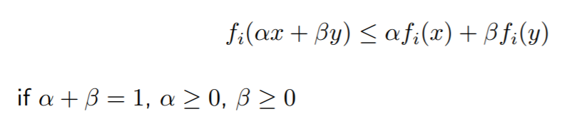

MarkdownよりPPTで書きたい。
用語メモ的な感じで行きたい。

# Convexとは
凸集合のこと。

最小化の際に仮定されるConvexの例がこちら。
以下の数式は右辺の内分点が実際の関数の点よりも大きい（つまり関数の形状が凹んでいる）ということを示す。

形状が凹んでたら最小値が一意に決まるよねという前提条件のことと理解している。

## Affine set
- 2つの点を選ぶと直線が引ける
- 任意の点群を選んだ際，それらを用いて引けうる直線の集合が**Affine set**

つまりLinearな線群はAffine集合と思って良さそう。
凸集合の定義がこれに関連付けられている。
